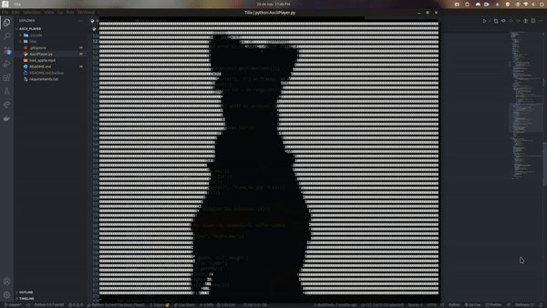

# ASCII PLAYER

This project takes a video file (it should be like Bad Apple animation), convert all frames to ASCII art, and play it in console.

I made it for "Bad Apple!", but it works with other videos.

## Dependences

    pillow
    pygame
    moviepy
    opencv-python
    progressbar
    fpstimer

## Use

Just start the program and put the video name file, if you use the video from the source (or use a video with filename "bad_apple.mp4" and put it on the same directory with the program), you can just press Enter and it will load to the program.

If you want to use other video, just write the name of the file.

    ================ASCII Video Player================
    File Name (Enter for 'bad_apple.mp4'): other_video.mp4

You can change the video size from the menu and after that play with option 1, or use the default size (60x170) using option 1 in first time.

    =============== ASCII Video Player ===============
    File: bad_apple.mp4
    [1] Play
    [2] Use terminal size (30x130)
    [3] Use custom size
    [4] Delete Files
    [5] Exit
    > 

If you change the size of the video, after having used another size, the files will be reloaded.